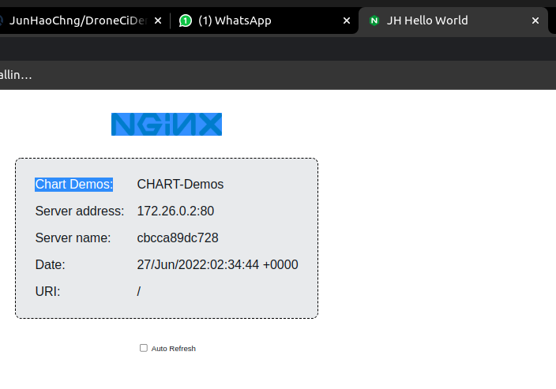

# DroneCiDemo


## Demo RMF Cloud Deployment Architecture


## Main Point: 

CI/CD is useful for deploying your applications in a scalable manner in the cloud. 

## Tutorial Objective: 

Make a code change to simple webapp, and deploy it using CI/CD tools. 

## Tutorial flow: 

1. Showcase - code change to deployment 
2. Architecture - What's going on????
3. Wireguard setup connect everyone - Ping!
4. Create github acc 
5. Make a code change to the web app  
6. Deploy docker container! 
7. Marvel at your new app 

## Showcase
Terminal 1:
```
docker-compose -f drone-docker-compose.yml up
```
Terminal 2:
```
ngrok http 80
```
This repo uses Drone.io for CI. Useful tutorial by a guy from youtube:

https://www.youtube.com/watch?v=myCcJJ_Fk10&t=361s&ab_channel=ThatDevOpsGuy

## Architecture
* Github 
> Version control for your code. Sends a webhook on code change
* Drone.io
> Performs actions on code change, triggered by webhook. In this case, builds our code into a lightweight portable Docker image. This makes things easily scalable and maintainable.
*  Docker
> Packages your application into a self-contained and OS agnostic image/container. 
* Kubernetes
> Deploys and manages your applications. I.e. Manages things like: secrets, ingress, when to restart, etc.. 
## Wireguard setup
Place the file I have given you to /etc/wireguard/
```
sudo wg-quick up wg0
```
To see if it works, ping me
```
ping 10.0.2.1 # Ping cloud server
ping 10.0.2.3 # Ping JH
```
## Create github acc 
https://github.com/join

Then create a github PAT

https://catalyst.zoho.com/help/tutorials/githubbot/generate-access-token.html
## Make a code change to the web app!
Get a copy of this repo
```
git clone https://github.com/JunHaoChng/DroneCiDemo.git
```
Make a new branch
```
git checkout -b YOURNAME
```
1. Make the code change here!
    1. Go to the nginx-hello/index.html file
    2. Line 5
    3. Change "Hello World" to "YOURNAME Hello World"
2. Change the name of your docker image
    1. .drone.yml 
    1. line 18
    2. Change the "10.0.2.3.../nginxhello" to "10.0.2.3.../YOURNAME-nginxhello" 
Save your code changes in Git
```
git commit -am 'New push!'
git push # Use your github PAT here
```
## Deploy docker container! 
```
docker run -P -p 8081:80 YOURNAME-nginxhello
```
## Marvel at your new app 
Opem your web browser and type in
```
http://localhost:8081
```
You should see the title of the webpage change to YOURNAME Hello World



<!-- Commands
ngrok http 80


 -->
 <!-- 
docker-compose -f drone-docker-compose.yml up -d

https://github.com/localtunnel/localtunnel
Dependency:
  NodeJs: 14.17.4
  https://www.digitalocean.com/community/tutorials/how-to-install-node-js-on-ubuntu-20-04
    Use the PPA method

lt --port 80 --subdomain heartbeatbedokbuildfarm --print-requests
ngrok http --subdomain=heartbeatbedokbuildfarm 80

openssl rand -hex 16

curl -s YOURIPADDRESS:PORT | grep title.*title

curl http://localhost:5000/v2/_catalog

docker run -P -p 8081:80 nginxdemos/hello

https://ce5e-103-252-200-229.ap.ngrok.io/hook

## CD

```
curl -LO https://get.helm.sh/helm-v3.4.0-linux-amd64.tar.gz

```

## CHANGE HERE

DRONE_SERVER_PROXY_HOST
    <title>Test Out Hello World</title>
drone.yml -->